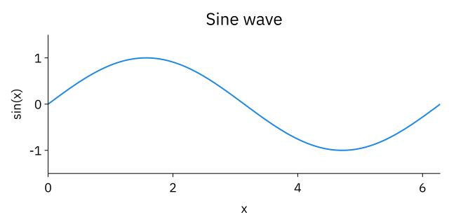

# Gum

Gum is a JSX language for vector graphics: plots, diagrams, mathematical figures,
and slides. Compose shapes, text, and TeX with measured layouts, then export SVG,
PNG, or PDF, or display the result directly in an image-capable terminal.

Use Gum as a command-line tool, a TypeScript library, or through its browser
editor and React bindings. JSX figures use ordinary JavaScript functions and data;
they do not require React.

[Getting started](gum-jsx-docs/docs/gallery/text/Gum.md) ·
[Documentation and gallery](gum-jsx-docs/README.md) ·
[CLI reference](gum-jsx-cli/README.md)

## Get started

For the 2.0 prerelease, use Bun 1.4.2 or newer on Linux x64 and install the CLI:

```sh
bun install -g @gum-jsx/cli@beta
```

The CLI includes the core renderer, TeX, Markdown, and PNG/PDF exporters. It
provides the `gum`, `gum-tex`, and `gum-mark` commands, ready to run with Bun.

Save this as `figure.jsx`:

```jsx
<Plot
  width={px(640)}
  aspect={2}
  font-size={px(18)}
  title="Sine wave"
  xlabel="x"
  ylabel="sin(x)"
  xlim={[0, tau]}
  ylim={[-1.5, 1.5]}
  background="white"
>
  <SymLine
    fy={sin}
    xlim={[0, tau]}
    samples={161}
    stroke={blue}
    stroke-width={px(2)}
  />
</Plot>
```

Render it:

```sh
gum figure.jsx -o figure.svg
gum figure.jsx -o figure.png --ratio 2
gum figure.jsx -o figure.pdf
```



Elements, units, and helpers such as `Plot`, `px`, `sin`, and `tau` are already in
scope. Use `px(24)` for pixels, `em(1.5)` for font-relative lengths, and fractions
such as `0.5` for relative sizes. Gum measures text and composes layouts with
boxes, stacks, and positioned canvases. Start with the
[units](gum-jsx-docs/docs/gallery/text/Units.md) and
[sizing](gum-jsx-docs/docs/gallery/text/Sizing.md) guides.

## Ways to use Gum

**Command line.** Omit `-o` to display a figure in a terminal supporting the kitty
graphics protocol. Use `-f svg` for SVG on stdout, or `-f tree --stats` to inspect
layout. The CLI includes math and Markdown commands:

```sh
gum figure.jsx
gum figure.jsx -f tree --stats
gum slides/ -o talk.pdf
gum-tex 'e^{i\pi}+1=0' -o euler.svg
gum-mark notes.md
```

PNG and terminal rendering use node-canvas, which needs its native dependencies
and SVG support. PDF output preserves vector paths and embedded PNG images;
text is outlined and is not searchable or selectable. See the
[CLI](gum-jsx-cli/README.md) and [PDF](gum-jsx-pdf/README.md) references for details.

**Browser editor.** From a [development checkout](#development), run `bun run dev`
and open the printed URL to edit JSX with a live SVG preview. The `/docs` page
provides searchable, editable examples.

**Library.** Evaluate JSX and render it to SVG from a Bun script:

```ts
import { evaluate, render_element } from '@gum-jsx/core'

const source = await Bun.file('figure.jsx').text()
const result = render_element(evaluate(source))
if (result.kind === 'svg') {
  await Bun.write('figure.svg', result.svg)
}
```

You can also construct elements directly in TypeScript. The core and math
renderers support browser hosts with preloaded font resources. Use
[@gum-jsx/math](gum-jsx-math/README.md) for TeX or
[@gum-jsx/react](gum-jsx-react/README.md) to compose figures as React components.
Evaluated JSX executes JavaScript in the host environment; use trusted source
or an application-provided isolation boundary.

**Coding agents and MCP.** From a development checkout, `bun run skill` builds a
portable authoring skill from the maintained documentation. The
[MCP server](gum-jsx-mcp/README.md) provides documentation tools, PNG inspection,
and an embedded figure viewer.

## Packages

Each package is a separate repository, developed together through Git submodules.

| Package | Purpose |
| --- | --- |
| [@gum-jsx/core](gum-jsx-core/README.md) | JSX evaluation, layout, shapes, text, plots, networks, and SVG output. |
| [@gum-jsx/math](gum-jsx-math/README.md) | TeX parsing, math layout, and standalone formula exports. |
| [@gum-jsx/png](gum-jsx-png/README.md) | SVG rasterization to PNG or RGBA through node-canvas. |
| [@gum-jsx/pdf](gum-jsx-pdf/README.md) | Vector PDF export from laid-out fragments. |
| [@gum-jsx/react](gum-jsx-react/README.md) | React bindings, headless rendering, and the `gum-react` command. |
| [@gum-jsx/mark](gum-jsx-mark/README.md) | Markdown terminal rendering with figures and math. |
| [@gum-jsx/cli](gum-jsx-cli/README.md) | The `gum`, `gum-tex`, and `gum-mark` commands. |
| [@gum-jsx/edit](gum-jsx-edit/README.md) | Browser editor and interactive documentation viewer. |
| [@gum-jsx/docs](gum-jsx-docs/README.md) | Guides, element references, gallery sources, and skill generation. |
| [@gum-jsx/mcp](gum-jsx-mcp/README.md) | MCP tools and an MCP Apps figure viewer. |

## Development

Clone the workspace and its package submodules:

```sh
git clone https://github.com/CompendiumLabs/gum-jsx.git
cd gum-jsx
git -c url."https://github.com/".insteadOf=git@github.com: submodule update --init --recursive
bun install
```

The submodule command uses HTTPS for the repository's SSH remotes, so a public
checkout does not require a GitHub SSH key.

Run shared commands from the workspace root:

```sh
bun run test          # Every package's suite, sequentially
bun run typecheck     # TypeScript checks across all packages
bun run build         # Production browser editor and docs viewer
bun run visual-test   # Searchable HTML report of rendered examples
bun run rehearse      # Publish to a temporary local registry and check fresh installs
```

To work on one package, use its scripts, for example
`bun --filter @gum-jsx/core test`. Package READMEs cover additional checks and
dependencies. The [design](docs/DESIGN.md), [roadmap](docs/ROADMAP.md), and
[feature map](docs/FEATURES.md) describe implementation decisions and planned work.
The [release checklist](docs/RELEASE.md) covers packaging and publication checks.
