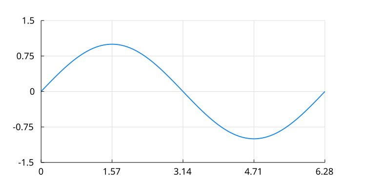

<div align="center">

<br/>
</div>

<div align="center">

<br/><br/>
</div>

<p align="center">
  Gum is a JSX vector graphics language that evaluates to SVG.
  <br/>
  It is designed for plots, diagrams, flow charts, and more.
</p>

<p align="center">
  <a href="https://compendiumlabs.ai/gum/studio">Live Demo</a>
  |
  <a href="https://compendiumlabs.ai/gum/docs">Documentation</a>
  |
  <a href="https://compendiumlabs.ai/gum/docs/gala">Gallery</a>
</p>

## Installation

```bash
bun i gum-jsx
```

This installs the batteries-included `gum-jsx` package: the `gum`, `gum-tex`, and `gum-mark` commands plus everything below. Add a `-g` flag to install globally and get the commands on your `PATH`.

The pieces are also published separately as pure libraries, for hosts that only need part of the stack (a browser, a server that only produces SVG):

| Package | What it is |
|---|---|
| [`@gum-jsx/core`](https://github.com/CompendiumLabs/gum-jsx-core) | The JSX → SVG evaluator, the elements, and the fonts; browser-safe |
| [`@gum-jsx/math`](https://github.com/CompendiumLabs/gum-jsx-math) | LaTeX: `<Latex>`, `<Tex>`, and the standalone `mathToSvg`; browser-safe |
| [`@gum-jsx/node`](https://github.com/CompendiumLabs/gum-jsx-node) | PNG rasterizing with node-canvas and kitty terminal output |
| [`@gum-jsx/mark`](https://github.com/CompendiumLabs/gum-jsx-mark) | Markdown to terminal, with gum figures and math inline |
| [`@gum-jsx/docs`](https://github.com/CompendiumLabs/gum-jsx-docs) | The documentation and gallery examples, and the Claude skill built from them (`skills/gum-jsx.skill`) |
| [`@gum-jsx/react`](https://github.com/CompendiumLabs/react-gum-jsx) | React bindings and the `gum-react` command |

Nothing in `@gum-jsx/*` is node-specific except `@gum-jsx/node` and `@gum-jsx/mark`. See [gum.py](https://github.com/CompendiumLabs/gum.py) for a Python wrapper.

## Library Usage

Write some `gum.jsx` code:

```jsx
<Plot xlim={[0, 2*pi]} ylim={[-1.5, 1.5]} grid margin={[0.2, 0.1]} aspect={2}>
  <SymLine fy={sin} stroke={blue} stroke-width={2} />
</Plot>
```

Then evaluate it to SVG:

```javascript
import { evaluateGum } from 'gum-jsx/eval'
const elem = evaluateGum(jsx)
const svg = elem.svg()
```

Which will produce the following:



You can also use JavaScript directly:

```javascript
import { Plot, SymLine, pi, sin, blue } from 'gum-jsx'
const elem = new Plot({
  children: [ new SymLine({ fy: sin, stroke: blue, stroke_width: 2 }) ],
  xlim: [0, 2*pi], ylim: [-1.5, 1.5], grid: true, margin: [0.2, 0.1], aspect: 2,
})
const svg = elem.svg()
```

`gum-jsx` re-exports everything from the libraries, and each of its entry points applies the math plugin to the default `Env` (`gum.use(math)`), so `<Latex>` works out of the box:

```javascript
import { evaluateGum } from 'gum-jsx/eval'          // the default Env, with <Latex> and friends
import { rasterizeSvg, formatImage } from 'gum-jsx/render'
import { mathToSvg, mathToPng } from 'gum-jsx/math'
import { displayMarkdown } from 'gum-jsx/mark'

const svg = evaluateGum('<Plot xlim={[0, 2*pi]} ylim={[-1.5, 1.5]} grid><SymLine fy={sin} stroke={blue} /></Plot>').svg()
const png = rasterizeSvg(svg, { size: 800, background: 'white' })
```

See the individual packages' READMEs for the library APIs: the evaluator's options and the element constructors in `@gum-jsx/core`, math rendering in `@gum-jsx/math`, rasterizing in `@gum-jsx/node`.

## Command Line

You can use the `gum` command to convert `gum.jsx` into SVG text or PNG data. You can even just display it directly in the terminal. For the latter you need a terminal that supports images, such as `ghostty` or `kitty`. There are a bunch of code examples in `docs/code/` and `gala/code/` of `@gum-jsx/docs` to try out.

Generate an SVG from a `gum.jsx` file:

```bash
gum input.jsx -o output.svg
```

Generate a PNG from a `gum.jsx` file:

```bash
gum input.jsx -o output.png
```

Display a `gum.jsx` file in the terminal:
```bash
gum input.jsx
```

CLI options:

| Option | Description | Default |
|--------|-------------|---------|
| `file` | Gum JSX file to render | stdin |
| `-s, --size <size>` | SVG/viewBox size in pixels | 1000 |
| `-u, --unit-size <size>` | Image size at which `stroke_width = 1` is one pixel | 1000 |
| `-t, --theme <theme>` | Theme: `light` or `dark` | light |
| `-b, --background <color>` | Background color | white |
| `-f, --format <format>` | Format: `json`, `svg`, `png`, `kitty` | auto |
| `-o, --output <output>` | Output file | stdout |
| `-r, --raster-size <size>` | Max rasterized PNG size | auto |
| `-d, --dev` | Live update display | off |
| `--strict` | Throw on rendering fallbacks instead of drawing them | off |
| `--seed <seed>` | Seed for `random`/`uniform`/`normal`/`integer` | 42 |

## Math and Markdown

LaTeX math (`<Latex>`, `<Tex>`, and the standalone `mathToSvg`/`mathToPng`) comes from `@gum-jsx/math`; the `gum` command has it registered, so `<Latex>` works in any file. The `gum-tex` command renders a formula on its own, and `gum-mark` shows a Markdown document in a kitty-protocol terminal with fenced `gum` blocks, images, and `$...$` math drawn inline:

```bash
gum-tex '\sum_{n=1}^\infty \frac{1}{n^2} = \frac{\pi^2}{6}' -o sum.svg   # LaTeX to SVG/PNG/terminal (see @gum-jsx/math)
gum-mark notes.md -t light -H 100                                      # Markdown in a kitty terminal (see @gum-jsx/mark)
```

## Development

```bash
bun test/run.ts            # render every docs, gala and test example in strict mode
bun test/run.ts --report   # also write test/data for the report browser
bun run report                 # browse the report at the printed URL
```

The packages live in separate repositories under [CompendiumLabs](https://github.com/CompendiumLabs) and are developed together as a bun workspace; the Claude skill for writing gum.jsx lives in `@gum-jsx/docs`, generated from the docs and gallery there (`bun run skill` in that package, which writes `skills/gum-jsx` and zips it to `skills/gum-jsx.skill`).
