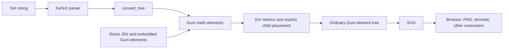

# Math architecture and implementation roadmap

Status: phases 1–4 implemented, September 14, 2026. Phases 5–8 remain planned.

The [math package](../gum-next-math/README.md) now supplies glyphs, signed glue,
rows/columns/boxes, and the first TeX slice, with CLI/editor bindings and
[runnable examples](../gum-next-docs/topics/text/Math.md). Core carries passive
math metrics/context and lazy font registration; it does not depend on math.
KaTeX is pinned to 0.16.47.

Phase 3 adds `MathOp`, `SupSub`, `Frac`, `Sqrt`, and `Bracket`, with
[ordinary-expression examples](../gum-next-docs/topics/text/MathExpressions.md).
It covers all eight styles, TeX size declarations and `\mathchoice`, scripts,
operator limits, generalized/continued fractions, binomials, root indices,
fixed delimiters, and complete left/middle/right delimiter groups. `size_index`
is optional passive context data so font-size declarations retain the correct
script table and cache identity.

The new display and inline comparison galleries are available through
`bun run compare --suite 3` (add `--inline` for text style). Comparison caught
the distinction between a large operator's logical TeX height and its outline
ink, and the need to preserve baselines across local size declarations. Tests
also cover explicit limits, custom fraction-rule dimensions, cramped descent,
scriptscript floors, missing size-font glyphs, and prepared-source reuse.
The adapter also restores explicit limits on operator names, including macro
expansions, where KaTeX's original operator-name nodes discard those flags.
Fractions expose TeX's ordinary atom class. Tall ordinary delimiters retain
the planned uniform-scaling fallback; vertical bars and radicals preserve width.
Extensible-piece assembly remains deferred.

Phase 4 connects [formulas inside prose](../gum-next-docs/topics/text/InlineMath.md)
and [Gum elements inside formulas](../gum-next-docs/topics/text/MathComposition.md).
Core `Text` has generic indivisible element tokens with Unicode break behavior,
baseline alignment, and line boxes that accommodate logical inline extents.
Shaping remains cached across widths; reference-dependent element measurement
stays in layout. Styled spans pass size/color through, and text boxes, bullet
items, captions, and titles normalize mixed prose into a paragraph while
preserving a sole block child.

`TextMode` provides literal runs, spaces, kerning, and bundled text-face controls
without changing nested math fonts. The existing `\text`/`\textrm`/`\textnormal`
slice now uses that path, including nested math. Source newlines become spaces;
wrapping prose belongs in an explicitly sized `Text`. Ordinary operands retain
their explicit dimensions and first baseline, including plots and multiline
text. Translation, fitting, and transforms preserve guides when those guides
remain horizontal; rotated children retain their own geometry and guides.

The phase-4 comparison suite (`bun run compare --suite 4`, optionally `--inline`)
covers literal text, kerning, text operands/scripts, nested math, and color.
The CLI and production-browser galleries include the same mixed-content docs.
Full TeX text-font command composition remains in phase 6; arrays
and multiline math environments are the next implementation phase.

The [comparison script](../gum-next-math/scripts/compare.ts) adapts gum-1's tool
and renders Gum, KaTeX HTML, and pdflatex side by side at equal pixels per em.
The first ten-formula gallery caught an italic-spacing defect: TeX correction
must come from font metric data, independently of measured ink overhang. This
is corrected and regression-tested. Group/color behavior follows KaTeX; LaTeX's
color grouping and text spacing can differ. The script preserves diagnostics
and exits unsuccessfully if any requested renderer fails.

Verification commands are `bun run test`, `bun run typecheck`, `bun run build`,
`bun gum-next-math/scripts/check-browser.ts`, and
`bun run compare --suite -S 48 -o gum-next-math/out/comparison.png`.
The remaining sections retain the original architecture review and roadmap.

The recommendation is to retain gum-1's math model and typographic rules in a
separate `gum-next-math` package, implemented on gum-next's existing
element/layout/fragment protocol. Keep KaTeX for parsing and its font assets;
use Gum's own layout and glyph outlines for rendering. Prioritize ordinary
formulas, direct JSX composition, and math inside prose, then complete the
remaining command coverage.

This is a port of the mathematical behavior, with a rewrite of its integration
with layout. The valuable parts are atom spacing, style transitions, glyph
selection, and placement rules. Constructor-time measurement, element cloning
to place children, and SVG text/font registration belong to the old engine.

## 1. Review basis

The review follows the sibling `../../gum-org` checkout, especially:

| Source | Responsibility |
|---|---|
| [math src/elems.ts][old-elems] | Almost the entire subsystem: about 2,900 lines containing metrics, styles, spacing, elements, shapes, parser conversion, and registration. |
| [math src/symbols.ts][old-symbols], [src/skew.ts][old-skew] | Copied KaTeX symbol/alias data and selected font accent-skew values. |
| [math src/fonts.ts][old-fonts], [src/index.ts][old-index] | Eighteen KaTeX faces, base/extra loading tiers, exports, and the environment plugin. |
| [math src/math.ts][old-render] | Standalone element/SVG helpers, natural sizing, padding, and asynchronous font loading. |
| [core src/lib/em.ts][old-em], [src/elems/em.ts][old-em-layout] | Shared em box protocol, adaptation of arbitrary elements, placement, and row/column layout. |
| [core src/elems/text.ts][old-text], [src/lib/text.ts][old-font-metrics] | Glyph measurements, ink-framed spans, prose layout, and embedding elements in text. |
| [core src/env.ts][old-env], [src/lib/strict.ts][old-strict] | Plugin registration, font/resource scope, themes, and strict rendering failures. |
| [example corpus][old-corpus], [test runner][old-tests], [comparison tool][old-compare] | Feature examples, strict rendering checks, and comparison with KaTeX and pdflatex. |

Reviewed math revision: `732770e`; legacy core: `a2d449a`; legacy umbrella
package: `4b6aced`. Gum-next core is `b205edd`. The legacy workspace has local
manifest/lockfile changes; its **installed KaTeX and workspace lock resolve to
0.16.47**, while the math package declares `^0.16.33`.

The old [design document][old-design] describes an earlier implementation. In
particular, arrays and cramped styles now exist, radicals use font glyphs, and
delimiter fitting chooses an adequate natural glyph before stretching. The
[coverage document][old-coverage] is more useful, but its version, coverage
counts, and outstanding-bug list also need to be checked against source.

Review-time checks:

- Rendered the 64 `math_*.jsx` files plus the three other filenames containing
  `math` in the legacy feature directory. All 67 rendered in both light and dark
  themes: 132 strict renders and two intentionally permissive renders of
  `math_parse_error.jsx`. This checks construction/rendering, not visual accuracy.
- Confirmed 41 explicitly handled node types in `convert_tree`. A handled node
  type does not mean every command, field, or combination using it is supported.
- Ran targeted comparisons for spacing, accents, fractions, limits, unsupported
  nodes, and missing glyphs; findings appear below.
- Registered all 18 legacy KaTeX TTF faces with gum-next's existing `Fonts` and
  shaped representative letters, operators, delimiters, and a radical. No font
  library replacement is needed for the initial port.

The historical claims of 57 total node types, 33 environments, symbol coverage
counts, and 119 tests are useful background. They are not a fresh compatibility
measurement, and the 119 count should not be treated as 119 math assertions.

## 2. How gum-1 math works

### Entry points and ownership

`@gum-jsx/math` is optional. Importing it has no registration side effect;
`env.use(math)` installs `MATH_ELEMS`, font-name bindings such as `mathbb`, and
the KaTeX font registry entries. The umbrella `gum-jsx` package applies this
plugin to its default environment. The standalone helpers derive an environment
and apply it themselves. [Entry points][old-index], [registration][old-elems]

There are two ways into the same layout code:

- `Latex` parses a string, defaulting to display style. `Tex` is its inline/text
  style convenience. Both default to a minimum strut around the formula.
- JSX constructs `MathText`, `Frac`, `SupSub`, `Sqrt`, `MathArray`, and the other
  elements directly. String leaves in math containers are parsed as TeX;
  `TextMode` creates literal text-mode symbols instead. Arbitrary Gum elements
  can be operands, numerators, labels, and scripts.



KaTeX supplies syntax, macro expansion, fonts, and reference data. Gum does not
use its HTML/MathML layout output to draw formulas. This is what makes a Gum
figure inside a fraction possible without a separate rendering surface.

### Parsing and conversion

`parse_math` calls the internal KaTeX `__parse` API. It passes `displayMode`
according to the math style and a warning handler that suppresses only
`newLineInDisplayMode`. Display mode matters during parsing: several AMS
environments are rejected outside it. Macros defined in the source are expanded
by KaTeX; the wrapper does not forward a general parser-options object.

`convert_tree` recursively translates nodes into public math elements. Its
context carries ordinary leaf attributes, the current math style, the active
size-command multiplier, and a separate text-mode font face. Keeping the text
face separate prevents `\text{... $x$ ...}` from forcing the embedded math into
the text face. [Parser and converter][old-elems]

Conversion distinguishes **a sequence of atoms** from **one grouped atom**.
Nested `MathText` sequences can flatten into their parent, preserving spacing
across color and similar boundaries. `seal_math` prevents that flattening when
grouping, class overrides, sizing, or modified metrics must survive. For
example, `{a+b}` is one ordinary atom, while a color change can leave `+`
participating in the surrounding row's binary-spacing calculation.

Some constructs need more than a node-to-class lookup: scripts on a single
accented character attach to its nucleus; braces consume a script as their
label; `\overset` makes an operator from an arbitrary body; generalized
fractions can add fixed-size delimiters. These relationships belong in the
conversion/layout model and must survive the rewrite.

### The metric protocol

Every math participant has an `em` record. `MathSpec` extends core's `EmSpec`:

| Field | Meaning in gum-1 |
|---|---|
| `width`, `height` | Logical layout box, in em. Width is generally advance, not the horizontal ink hull. |
| `anchor` | Distance down from the box's top to the math axis. |
| `scale` | Content em relative to the em in which these measurements are expressed. |
| `hink`, `vink` | Optional ink overhang beyond the logical box. |
| `left`, `right` | TeX atom classes at the exposed edges. |
| `italic` | Italic correction used for scripts and operator limits. |
| `skew` | Accent displacement over a character. |

The axis is distinct from the baseline. An ordinary item's baseline sits
`0.25 * scale` em below its axis. `baseline_extents` translates this record into
the height/depth quantities used by TeX's placement rules. Anchors can lie
outside an ink-tight box; they are coordinates, not fractions to clamp.
[Metric definitions][old-em]

`MathSpan` is a core `Span` with `frame: 'ink'`. It uses actual glyph vertical
extents, retains advance width, and places the axis relative to the baseline.
Large operators can instead center their ink on the axis. Measurements come
from opentype.js, including kerning and the final glyph's right overhang;
accent skew comes from the separate KaTeX-derived table. This is not a complete
implementation of per-glyph TeX font metrics. [Glyph measurement][old-font-metrics]

Internal rows stay tight. A top-level `Latex`/`Tex` adds an optional zero-width,
one-em strut centered on the axis, so a short symbol does not define an unusually
short external line box.

### Composition and placement

`ensure_math`/`with_math` adapt an ordinary element into the protocol. A text
element can retain its measured em box and text anchor. An element without
metrics gets a one-em-high box, as wide as its aspect ratio, centered on the
axis. This automatic aspect-based adaptation is the old engine's convention,
not something gum-next should silently reproduce. [Adapters][old-em-layout]

`MathRow` and `MathCol` use core's shared em stack layout. `place_math` assembles
explicitly positioned children for scripts, fractions, accents, and limits.
Their logical boxes determine spacing; ink overhang determines what must remain
visible. Drawn math shapes rebase stroke units to pixels per em so a fraction
bar or arrowhead scales with the formula.

These operations clone elements with new rectangles and patched metrics.
Cloning reconstructs elements, so `with_em` also maintains a rebuilding recipe
to preserve adaptations such as zero width, smash, and script scale. The
complexity is visible in `rebuild_em`, `EM_ADAPTATION`, and the clone regression
examples. Immutable fragments let gum-next express these as result data and
placements instead.

Prose uses a separate bridge: `ElemSpan` recognizes em-aware children and pins
their axis to the text line. Tall math can overhang the old fixed line box.
Ordinary figures use the older one-line fitting convention. Math inside prose
and prose inside math are both supported, but by different adapters.
[Inline bridge][old-text]

### Typography and feature families

| Area | Current implementation and behavior to carry forward |
|---|---|
| Atom spacing | `MathText` applies binary-operator cancellation, then a class-pair spacing table. Thin/medium/thick spaces are 3/4/5 mu, with 18 mu per em. Explicit glue is transparent to neighboring atom classification. Script styles suppress medium/thick automatic glue. |
| Styles | Eight styles: display/text/script/scriptscript, each normal or cramped. Glyph scales are 1/1/0.7/0.5. Superscripts inherit crampedness, subscripts and denominators are cramped, radicals and overlines cramp their bodies. Descents use ratios, so nested scripts stop shrinking at scriptscript size. |
| Operators and scripts | Upright named operators; Size1/Size2 glyph operators for text/display; axis centering; side-script shifts, italic correction, superscript/subscript clearance, and over/under limit placement. |
| Fractions | TeX-style numerator/denominator shifts and bar clearance, style descent, no-bar variants, and binomial/generalized-fraction delimiters. The constants are Computer Modern-based approximations; the default fraction bar is deliberately lighter than the general rule. |
| Roots and delimiters | Search Main then Size1–4 for the first glyph large enough, skipping missing glyphs. Beyond the largest available size, delimiters scale uniformly and radicals stretch vertically. A radical joins a drawn rule and can carry a scriptscript-size index. There is no extensible-piece assembly. |
| Accents and stretches | Fixed glyph accents with skew; character-aware script attachment; drawn arrows, harpoons, braces, groups, segments, and tildes. Extensible arrows measure their labels before choosing width. Some wide-accent commands still use a fixed glyph fallback. |
| Arrays | `MathArray` measures row height/depth and column widths, then places cells. It handles column alignments, separators, row gaps, struts, array stretch, leading, and horizontal/dashed rules. Many named environments normalize to this one node plus delimiters/style wrappers. It is a natural math table, not a width-distributing general grid. |
| Box operations | Phantom keeps dimensions without drawing; smash removes layout height/depth while retaining ink; lap gives zero advance with overhang; raisebox/vcenter move an anchored body. Boxes, background colors, cancel strokes, strikeout, and poor-man's bold compose ordinary geometry. |
| Text and fonts | Symbol aliases and classes select math/text/AMS faces; explicit math families fall back per glyph. Text family, weight, and italic commands compose separately. `TextMode` is literal text inside math, while ordinary `Text` retains prose layout. |

All of these are implemented in [the math element module][old-elems]. The
constants and algorithms are reusable; their constructor and coordinate-frame
plumbing is tightly tied to gum-1.

### Fonts, export, and failures

The font manifest has seven base faces (Math Italic, Main Regular, AMS, Size1–4)
and eleven additional style/family faces. Assets come from the KaTeX dependency.
Node/Bun loads registered paths on demand; browsers preload bytes. Async math
helpers first load the base tier and retry with the remaining tier after a
`FontNotLoadedError`. [Font manifest][old-fonts], [async helpers][old-render]

Gum-1 emits SVG `<text>`. Consequently its browser and raster hosts also need
the actual faces installed or embedded, using the same family/weight/style
mapping as measurement. `mathToElement` sizes a standalone SVG from math
metrics and font size, or fits it to an explicit size; the umbrella package
adds PNG/kitty helpers and `gum-tex`.

Permissive mode renders parse failures as red source, unknown symbols literally,
and unsupported nodes as empty space; some unsupported decorations preserve
only their body. Strict mode turns fallbacks into typed failures (`parse`,
`node`, `symbol`, `font`, `glyph`). This distinction makes the old example runner
useful, but it cannot detect a supported branch that draws the wrong thing.
Also, `parse_math` catches conversion failures as well as parser failures, so
unexpected implementation errors can be mislabeled as parse errors.
[Strict errors][old-strict]

## 3. What parity must mean

Use gum-1's supported behavior and examples as the migration target, with
explicit corrections for known defects. Avoid defining parity as identical SVG
or simply “the converter has a branch for this node.”

The review confirmed these concrete gaps:

| Finding | Evidence and consequence for gum-next |
|---|---|
| Negative kern is lost | `a\!b` and `ab` produce identical SVG in both display and inline modes, even though KaTeX produces a `kern` of `-3mu`. Preserve **signed advance** separately from nonnegative fragment sizes. |
| Wide hat is a fixed hat | `\widehat{abcdef}` and `\hat{abcdef}` produce identical SVG. `ACCENT_LABEL_FALLBACK` also maps wide check/tilde to fixed glyphs. Treat wide-accent sizing as real work, not completed coverage. |
| Fraction bar thickness is ignored | `\genfrac{}{}{2pt}{}{a}{b}` and `\frac{a}{b}` produce identical SVG. `barSize` and `continued` exist in the AST but are not read by the fraction conversion branch. Test their semantics explicitly. Zero thickness does reach the no-bar branch through `hasBarLine`. |
| Explicit limits do not always win | In inline mode `\int\limits_0^1` renders identically to `\int_0^1`. `MathOp` gates its limits flag on display style, and conversion does not preserve all explicit-limit semantics. Distinguish automatic, forced, and disabled limits. |
| Missing structural constructs | Strict probes fail for `\middle` and `\tag`. The `CD` arrow sample fails on its unsupported arrow label; having an `array`/`xArrow` branch is insufficient. These need enclosing-body, display-width, or table-cell information respectively. |
| Missing glyphs and decorations | `\origof` fails strict glyph lookup; `\phase{x}` fails strict enclosure handling. Keep unsupported features visible and documented. Font-command fallback, such as `\mathbb{a1A}`, is a separate supported behavior. |
| Large operators have real overhang | Gum-next's font probe measures Size2 `∮` with advance `0.556em` and rightmost ink at `0.944em`: `0.388em` lies beyond the advance. Gum-1's `MathSpan` does not record that horizontal ink in `hink`. Preserving advance and visible ink separately is essential. |

The coverage notes also report script-style fraction/delimiter drift. That
remains a visual/metric comparison task; this review did not remeasure the
historical error bounds. Large stretched delimiters, wide accents, radicals,
and different math styles deserve visual comparisons at a fixed pixels-per-em.

The old [comparison script][old-compare] supplies the right method: compare Gum,
KaTeX in a browser, and optionally pdflatex at the same em size. Use it as a
reference harness, with accepted differences recorded per feature. A strict
render success is a smoke check, not a typography oracle.

## 4. How this fits gum-next

The [feature inventory][next-features] already lists the desired public math
elements. Existing `src/lib/math.ts` and `test/math.ts` contain numeric helpers;
they are unrelated to formula typesetting and should retain that role.

| Existing facility | Reuse or required change |
|---|---|
| [Immutable Element][next-element] | Math constructors describe source only. Parse/prepare/layout work belongs to the pass; no fonts or metrics are attached to source instances. |
| [LayoutPass][next-pass] | Owns result caches, prepared data, resolved style, and versioned resources. Extend only the transported context/result contracts needed for math; keep typographic decisions in math elements. |
| [Fragment][next-fragment] | Already separates size, ink, overflow, guides, drawing, and placements. Add a deliberate contract for math atom metrics; `make_fragment` currently discards arbitrary extra fields. |
| [Fonts / FontProvider][next-fonts] | Already returns one-em advance, tight ink, and outline paths with baseline at zero and y downward. Add glyph-availability inspection and a math asset loader; keep Fontkit behind this boundary. |
| [Text / Span][next-text] | Already shapes runs, preserves word boundaries across spans, and reuses preparation across widths. It currently rejects other element children. Extend its inline token model to include measured elements. |
| [Box / Fit][next-box], [HStack][next-stack] | Preserve and transform named guides. Baseline-aligned rows already work once math supplies a baseline. Ordinary sizing stays at fixed font size; `Fit` explicitly scales a completed result. |
| [Svg][next-svg-element] and [serializer][next-svg] | Serialize final drawing without layout or font access. Root viewports clip: correct `.ink` alone does not make a natural math export safe from cropping. |
| [Evaluator][next-eval] | `evaluate(code, { scope })` can receive math bindings now. There is no need to recreate `Env` or a general plugin registry to expose the new package. |
| [Editor host][next-edit] and [PNG host][next-png] | Editor must load math font bytes before layout. PNG can consume the resulting paths without font registration. |
| [Document components][next-document], [axes][next-axis], [plots][next-plot] | Many titles, captions, and tick labels already accept elements. `TextBox`/bullets' content normalization also needs review for mixed prose and formula children. |

### Recommended package boundary

Add `gum-next-math` as another Bun workspace package and, following this
workspace's repository structure, a separate repository/submodule when that
package is established. It depends on core and a pinned KaTeX version. Core
must not import KaTeX or depend on math. CLI/editor explicitly compose core
evaluation with exported math bindings and font setup.

The initial dependency baseline should be the locally verified KaTeX 0.16.47,
with an exact version recorded in the new manifest/lockfile. An upgrade is a
separate compatibility change. Isolate the internal `__parse` API and its types
in one adapter, and preserve the source/license notices for copied symbol,
skew, and geometry data.

A suggested split, to avoid recreating the legacy monolith:

```text
gum-next-math/src/
  index.ts          public elements, bindings, and helper exports
  parse.ts          KaTeX adapter and conversion to immutable math descriptions
  types.ts          math source/context types and atom semantics
  metrics.ts        box arithmetic, styles, unit conversion, placement helpers
  spacing.ts        binary cancellation and inter-atom glue
  fonts.ts          assets, loading, family selection, glyph fallback
  symbols.ts        attributed symbol/alias data
  skew.ts           attributed accent-skew data
  elems/            leaves, rows, scripts, fractions, roots, accents, arrays
  stretch.ts        drawn extensible shapes
  errors.ts         structured math failures
  render.ts         standalone element/SVG helpers
```

### Layout and metric contracts

Use the ordinary `Element → LayoutPass → Fragment` path for public math
elements. Math helpers can manipulate temporary box records, just as stack
layout manipulates temporary item records; there should be no second global
math pass, intrinsic-measurement API, or rendering backend.

Recommended small additions to core's protocol:

- A read-only math context, transported like the existing coordinate context,
  carrying the style and active size-command multiplier. The pass includes it
  in result and prepared-content cache identity. Math elements own style
  descent and interpretation; core does not implement TeX rules.
- Named `baseline` and `math_axis` guides in pixels. These express vertical
  coordinates, including positions outside the box.
- An optional, explicitly copied/frozen math metric record on fragments. It
  carries signed advance, edge classes, italic correction, skew, and the
  nucleus/operator information needed by parents. Distances are pixels.
  Core owns the passive record contract so dependencies remain one-way;
  math owns its meaning and computation.

This is preferable to putting atom classes into numeric guides, storing
measurements on immutable elements, or attaching a side table to fragments
whose identity changes when `LayoutPass` normalizes them. Ordinary wrappers
preserve guides; they can be treated as ordinary atoms. Math-aware wrappers
explicitly preserve/reclassify atom information and clear glyph-only correction
when appropriate. They must not accidentally turn every decorated group into a
character nucleus.

Keep typographic constants in em and convert using the resolved local font
size. Script changes use relative scale between the eight styles; merely
multiplying every nesting level by `0.7` is wrong. Already measured children
have their own baseline/axis guides, avoiding the old need to infer their
baseline from a patched `em.scale`.

Represent negative kern as signed row advance, not a negative fragment width.
Represent lap/smash with a small or zero logical box and unchanged positioned
ink. Phantom retains the requested layout dimensions but no drawing. Keep
fraction rules, strokes, and explicit TeX measurements distinct from ordinary
Gum length props: `3mu` is typographic glue, while a public width uses `em()` or
`px()`. Bare Gum length numbers remain fractions of an established reference.

### Preparation, parsing, and errors

Cache parsing/normalization by source and all relevant parser settings,
including display mode and any exposed macros. Keep KaTeX AST objects private
to the adapter/preparation stage: their location/lexer objects are not suitable
immutable element props. Normalize useful source offsets and supported fields
into plain descriptions; preserve unsupported-node information for diagnostics.

Use `query.prepare` for offer-independent parsing/shaping work. It currently
keys on source element, resolved style, and resource epoch, but not offers,
references, or a math context. Add math context to its identity before relying
on it for styled math. Width-dependent embedded text/table work must remain in
layout, where requests and references are part of the query key.

Use typed math errors with a source span/command or node kind, wrapped by the
existing `LayoutError` path where appropriate. Distinguish parse errors,
unsupported constructs, missing glyphs, and unloaded fonts; programming errors
must propagate with their cause. Recommended default: library/CLI rendering
throws on unsupported math; the editor can show the error or explicitly use a
visible diagnostic fallback. An empty spacer is not an acceptable fallback for
an unsupported formula. KaTeX warning policy and Gum support checking are
separate settings.

### Text, embedding, and sizing

The main authoring contracts should be:

| Use | Proposed behavior |
|---|---|
| `Latex` / `Tex` | Keep familiar names and display/text defaults. Other math elements inherit their math context; explicit style overrides remain possible. |
| `MathText` string leaves | Parse as TeX; preserve boundaries that create a grouped atom versus a flattenable sequence. |
| `TextMode` string leaves | Literal text, including spaces; choose the math text face without affecting nested math. |
| Math inside `Text` | One indivisible inline item, aligned by baseline. Prose wraps around it; a long formula overflows rather than shrinking or breaking inside itself. |
| Line height with inline math | Start with the normal text strut, then enlarge the line for the item's logical above/below extents. Deliberate smash/overhang remains ink overflow. This is a conscious improvement over gum-1's fixed-line overhang behavior. |
| Ordinary element inside math | Measure through `query.child`. Prefer its `math_axis`; otherwise derive an axis from its baseline and local font, or center an element without either guide. Respect explicit dimensions. |
| Figure sizing | Require a concrete natural size or explicit `em()`/`px()` dimensions. Use `Fit` for intentional one-em fitting. Do not revive automatic aspect-to-one-em adaptation for every element. |
| Constrained formula | Natural/available requests retain the natural font-sized formula; exact allocations change the reported box and report overflow. Scaling requires `Fit`. No automatic equation breaking in the initial implementation. |

Extend prose tokens with generic inline elements, rather than importing math
into `Text`. Keep existing span kerning, whitespace normalization, nonbreaking
spaces, hard breaks, and preparation reuse. A formula embedded inside a styled
span must inherit that span's font size/color. For foreign elements using
relative dimensions, pass only an established reference; a trial width budget
is not a percentage reference.

The standalone math helper should wrap the natural formula in a viewport that
includes the union of its logical box and visible ink, translates negative
extents, and applies explicit padding before `Svg` clips. Inline advances remain
unchanged. CLI standalone math should use this same path. Ordinary explicit SVG
viewports retain their clipping policy; documentation must distinguish that
from an export sized to include a formula's ink.

### Rendering and hosts

Build glyph `PathDraw` records through `FontProvider`, and other pieces through
existing drawing/placement primitives. No KaTeX HTML, CSS layout, SVG text, or
font lookup is needed after layout. Preserve a formula-level source label for
inspection/accessibility without assigning repetitive labels to every glyph.
Structured MathML or spoken-math output is a later feature.

Add a small font-loading layer around the existing byte registration API. It
should share in-flight loads, expose base/full loading, register exact math
faces, and allow glyph-coverage queries without catching arbitrary shaping
errors. A reused pass must see a new font resource version after registration.
This also prevents synthetic oblique or nearest-weight selection from silently
substituting for a required KaTeX face.

Outlines make browser/SVG/PNG output independent of installed host fonts. They
also increase SVG size, so measure representative output before deciding
whether repeated-glyph definitions are worth adding. The renderer should stay
a serializer throughout this work.

## 5. Implementation sequence

Each phase should land with its own relevant metric assertions and runnable
examples. The sequence is 1 → 2 → 3 → 4 → 5 → 6 → 7 → 8; inline integration in
phase 4 can begin once phase 2's metric contract is working. Browser rendering
should be exercised from phase 1, even though the full authoring integration
comes later.

### Phase 1 — Package, metrics, and glyphs

Establish `gum-next-math`, workspace wiring, the parser dependency baseline,
and the narrow core protocol additions. Implement font registration/loading,
glyph coverage inspection, context/cache identity, atom metrics, explicit
placement helpers, `MathSpan`, `MathSymbol`, and `MathRule`.

Use the existing font provider for outline geometry. Math symbols select
KaTeX defaults independently of the surrounding prose family; an explicit math
font command can override them. Resolve all math ink, including rules and
strokes, from the formula's color unless explicitly overridden.

**Completion checks:**

- Constructing math source performs no font I/O or measurement.
- Glyph advance, ink, baseline, and axis are independently inspectable at two
  font sizes. An italic glyph and a Size2 integral retain their right overhang.
- The same source reused under different font sizes/math contexts produces the
  appropriate cached results. Changing font resource version invalidates them.
- Signed advance, zero-size boxes, and guides outside the box are supported
  without weakening `Fragment.size`'s nonnegative contract.
- A minimal browser build loads font assets and renders paths; an exported SVG
  requires no page CSS fonts to display them.

Primary work: new package; core `engine/fonts.ts`, `engine/fragment.ts`,
`engine/pass.ts`, shared protocol types, and relevant inspection support.

### Phase 2 — Rows and an end-to-end TeX slice

Implement `MathSpacer`, `MathRow`, `MathCol`, `MathBox`, `MathText`, `Latex`, and
`Tex`. Add symbol/atom/group/operator-name basics to the parser adapter, signed
glue, class overrides, binary cancellation, optional struts, and visible/strict
errors. Define flattenable sequences and grouped atoms explicitly rather than
depending on element subclasses being spliced after construction.

Bring up CLI/editor math bindings sufficiently to run these examples; keep the
integration small by using `evaluate`'s existing scope option.

**Completion checks:**

- `a+b=c`, unary `-x`, `a+-b`, `(a+b)`, grouped atoms, and color boundaries have
  asserted advances and operator spacing. Explicit glue does not reset atom
  classification.
- `a\!b` is narrower than `ab` by `3/18` of the active em, including at a
  non-default font size.
- A malformed expression and a recognized-but-unsupported node are distinct,
  visible failures. A valid sibling expression still renders after a failure.
- Natural, available, and exact requests obey the existing sizing contract;
  an exact small box reports overflow and does not rescale glyphs.

Primary work: math parsing, spacing, row/box elements, errors, evaluator-host
bindings, and focused examples in `gum-next-docs`.

### Phase 3 — Ordinary mathematical expressions

Implement `MathOp`, `SupSub`, `Frac`, `Sqrt`, and `Bracket`, including all eight
styles, style/size commands, `mathchoice`, scriptscript floors, named and large
operators, limits, binomials, root indices, and delimiter selection. Preserve
explicit limit policy and generalized-fraction fields during normalization.

Implement `\middle` at the enclosing delimiter group: first measure its body
runs without the middle delimiters, determine the group's vertical extent,
then select all delimiters against that extent. This is a useful small addition
to gum-1 coverage and avoids embedding a bottom-up-only assumption in the new
delimiter model.

**Completion checks:**

- Euler's identity, the quadratic formula, a Gaussian integral, nested
  fractions, and sums with limits render through both parsed TeX and direct JSX.
- Nested scripts bottom out at the intended style size; numerator/denominator,
  root, and cramped-style transitions have placement assertions.
- `\limits` and `\nolimits` override automatic operator behavior in both
  text and display styles. Script placement uses the base's italic correction.
- A custom fraction rule has the requested thickness; continued/no-bar
  fractions get their own expected geometry.
- Delimiters cover the required extent, tall radicals retain their horizontal
  proportions, and missing size-font glyphs select the correct fallback.
- Repeated occurrences share prepared glyph/source work rather than cloning
  and remeasuring the entire expression.

Primary work: math style/metric helpers, compound elements, parser fields, and
the first comparison gallery at a fixed pixels-per-em.

### Phase 4 — Math and ordinary Gum content in both directions

Extend `Text`'s inline preparation and line packing to include element tokens.
Add `TextMode` for literal math text. Integrate math inside styled spans,
`TextBox`, bullets, captions, and titles; audit `document.ts` normalization so a
mixture of prose and formulas is not mistaken for a single block element.

Allow ordinary elements in math rows and compound positions through
`query.child`. Resolve their baseline/axis and size using the contracts above.
Use explicit dimensions for figures and an explicit width for a wrapping text
block; do not infer a plot's aspect from a formula's available space.

**Completion checks:**

- A paragraph with multiple inline formulas wraps correctly at widths just
  above and below a break boundary, with no break inside a formula.
- Text line height accommodates an inline fraction without shrinking it.
  Span styling applies to the formula while ordinary kerning and whitespace
  tests continue to pass.
- A direct-JSX fraction can contain a colored shape or a small plot. A
  multiline text operand aligns by its first baseline and preserves its width.
- Reusing a formula in prose, a standalone row, and a script does not leak
  style, placement, or cached size between occurrences.
- Box padding, explicit fitting, text rows, rotated labels, and nested
  placements preserve guides and ink/overflow as appropriate.

This is the **first broadly useful release checkpoint**: common TeX plus Gum's
distinctive mixed-content composition. It should be reviewed before expanding
the command surface.

Primary work: core text/document composition and tests, math embedding helpers,
and runnable prose/plot examples.

### Phase 5 — Arrays and multiline environments

Implement `MathArray` independently of a general-purpose grid. Reuse the old
two-step row/column measurement, expressed with immutable fragments. Translate
the environment-specific fields supplied by KaTeX: cell styles, alignments,
pre/post column gaps, outer spacing, row gaps, array stretch, leading, and rules.

Cover arrays, matrix variants, cases, aligned/gathered, substack/smallmatrix,
and the display environments listed in the [feature inventory][next-features].
Track support by actual environment/variant, not merely by the `array` node.
Equation numbering and `CD` arrows remain explicitly outside this phase.

**Completion checks:**

- Unequal-width cells, tall fractions, script-size cells, empty cells, and
  left/center/right columns align correctly.
- Matrix/cases delimiters cover the completed table. Positive and negative
  row gaps, solid/dashed/double separators, and intersecting rules have
  meaningful geometry checks.
- Named aligned environments preserve relation spacing and leading, including
  the last row. Compare their natural box at the same font size with references.
- Narrow offers produce documented overflow; they do not trigger an implicit
  table-fitting search or require a new global grid solver.

Primary work: math arrays, environment conversion, and matrix/alignment docs.

### Phase 6 — Remaining legacy typography and box operations

Complete `Accent`, `Underline`, `Overline`, `MathStretch`, and `HorizBrace`;
extensible arrows and labels; overset/underset/stackrel; composed text and math
font commands; phantom/smash/lap; enclosures and cancellation; rule, raisebox,
vcenter, verbatim, and poor-man's bold. Validate macro expansion and scoping as
part of the parser surface, including any public macro options introduced.

Reuse the old geometric shape recipes where they remain a good match. Adapt
their curves/strokes to the current primitives rather than transplanting the
old arrow API. Implement actual wide-hat/check/tilde sizing instead of copying
the fixed-glyph aliases. Honor selected font coverage per glyph, including
bold-symbol fallback and text nested inside math.

**Completion checks:**

- Accents use character skew, scripts attach to the underlying nucleus when
  appropriate, and wide decorations respond to body width.
- Braces/arrows size from both body and labels; under/over placement, script
  style, and dark-theme color work for every implemented shape family.
- Phantom affects layout without ink; smash/lap retain ink without restoring
  suppressed dimensions. Zero-advance and negative-advance cases remain distinct.
- All eighteen font faces are exercised, expected per-glyph fallbacks are
  asserted, and missing glyphs are reported rather than substituted silently.
- All legacy supported node families have a named test, with field-level cases
  for branches where the smoke corpus previously hid errors.

Primary work: math decorations, shapes, font selection, converter coverage, and
the corresponding public-element reference pages.

### Phase 7 — Complete authoring and export integration

Expose standalone `mathToElement`, `mathToSvg`, and asynchronous convenience
helpers using the new API conventions. `mathToElement` should return an
immutable source description: its natural viewport is determined during normal
layout. SVG helpers create/use a pass and font resources; async helpers preload
first. PNG/kitty conveniences stay in their existing host packages.

Add a `gum-tex` entry point in `gum-next-cli` using the shared rendering path.
Finish editor font loading, bindings/completions, errors, and math documentation
navigation. Add examples for formula labels on axes/plots and math in slides.
Update the feature inventory only as behavior becomes available.

**Completion checks:**

- Equivalent source renders consistently through library, browser editor,
  SVG, PNG, and terminal output.
- Natural standalone exports contain italic overhang, tall operators, accents,
  and lap/smash ink at both edges. Empty/all-space formulas produce a valid
  documented viewport. Explicitly constrained SVGs retain their clipping rules.
- Font-size sizing and explicit `Fit` sizing are distinct and demonstrated.
- Cold browser loads, repeated formulas, concurrent loads, and an unloaded
  optional face behave predictably. No import-time fetch or global font setup
  leaks into core.
- Output remains understandable to inspection tools and carries a useful
  formula label. Exported SVGs display without installed KaTeX fonts.

Primary work: math rendering helpers, CLI/editor hosts, PNG convenience wiring,
and documentation. A second font-registration system in the PNG renderer is
unnecessary.

### Phase 8 — Parity review and stabilization

Migrate the legacy examples to gum-next syntax, then run a coverage audit
against the pinned parser. Keep a matrix of node types, commands, significant
fields, environments, and explicit unsupported cases. Record intentional
differences from gum-1 alongside the examples that demonstrate them.

Use three complementary checks:

1. **Numeric contracts:** advance, baseline/axis, ink, overflow, style scaling,
   rule thickness, operator gaps, line breaks, and array placement. Assertions
   should express typography/layout expectations, not repeat implementation.
2. **Integration:** JSX and TeX equivalence for representative constructs;
   immutable reuse; different requests/styles in one pass; resource changes;
   mixed text/figures; strict error reporting; browser loading and export.
3. **Visual comparisons:** a curated set against gum-1 and KaTeX, with pdflatex
   where useful. Preserve font-size equivalence and allow deliberate outline
   rasterization differences. A zero pixel diff is not the acceptance rule.

Measure a long equation, nested scripts/fractions, a sizeable matrix, and many
repeated inline formulas. Check pass statistics, shaping reuse, preparation
cost, output size, and cold/warm font loading. Add bounded regressions for any
actual pathological behavior; avoid speculative global caches.

Run the appropriate workspace checks: `bun run test` for affected core
contracts, a math package test command wired into the root test workflow,
`bun run typecheck`, and `bun run build` for browser integration. Documentation
examples should also be rendered by the test workflow.

**Completion gate:** common formulas and the agreed legacy feature surface work
in both authoring forms and all current hosts; confirmed legacy defects have
either regression-tested corrections or an explicit accepted limitation;
unsupported inputs cannot disappear silently; and core remains usable without
loading the math package or its assets.

## 6. Deferred work and review decisions

These should not block the first implementation:

- Display-margin `\tag` and automatic equation numbering. These need an
  explicit display container with an available width and a collision policy;
  naturally sized inline math has no meaningful margin.
- Full `CD` commutative diagrams, including cell-spanning arrows and labels.
  This is table-aware assembly beyond ordinary `MathArray` support.
- Exotic enclosures (`\phase`, `\angl`, `\angln`) and symbols absent from the
  selected fonts. Keep explicit unsupported diagnostics until a visual design
  or alternate glyph source is chosen.
- Automatic line breaking inside equations, full LaTeX document/package
  support, trusted HTML/image commands, and general OpenType MATH font support.
- Extensible-piece glyph assembly, native selectable SVG text, semantic MathML
  or speech, and dedicated PDF/React integrations. Existing path export is the
  initial rendering contract.

The main decisions proposed for this review are:

| Decision | Recommendation |
|---|---|
| Package/dependency scope | Separate math workspace/submodule; KaTeX parser/fonts behind one pinned adapter; no core dependency on math. |
| Engine integration | Ordinary layout queries and fragments, with a small transported math context and passive atom metric record. |
| Rendering | Fontkit outlines and existing drawing primitives; retain independent logical advance and ink. |
| Authoring | Preserve familiar math element names and direct JSX composition; use gum-next units and explicit fitting for figures. |
| Prose | Generic inline-element support in `Text`, with line height expanded by logical extents and formulas kept indivisible. |
| Error behavior | Explicit failures by default; optional visible editor diagnostics. No silent dropped nodes. |
| First implementation checkpoint | Phases 1–4: core math protocol, ordinary formulas, and composition in both directions. |
| Parity scope | Correct the confirmed spacing/metrics/limits defects, add `\middle` during delimiter work, and defer tags/CD/specialized features explicitly. |

Phases 1–4 now form the first broadly useful review checkpoint. The next
implementation phase is phase 5: arrays and multiline math environments.

[old-elems]: ../../gum-org/gum-jsx-math/src/elems.ts
[old-symbols]: ../../gum-org/gum-jsx-math/src/symbols.ts
[old-skew]: ../../gum-org/gum-jsx-math/src/skew.ts
[old-fonts]: ../../gum-org/gum-jsx-math/src/fonts.ts
[old-index]: ../../gum-org/gum-jsx-math/src/index.ts
[old-render]: ../../gum-org/gum-jsx-math/src/math.ts
[old-em]: ../../gum-org/gum-jsx-core/src/lib/em.ts
[old-em-layout]: ../../gum-org/gum-jsx-core/src/elems/em.ts
[old-text]: ../../gum-org/gum-jsx-core/src/elems/text.ts
[old-font-metrics]: ../../gum-org/gum-jsx-core/src/lib/text.ts
[old-env]: ../../gum-org/gum-jsx-core/src/env.ts
[old-strict]: ../../gum-org/gum-jsx-core/src/lib/strict.ts
[old-corpus]: ../../gum-org/gum-jsx/test/code
[old-tests]: ../../gum-org/gum-jsx/test/unit.ts
[old-compare]: ../../gum-org/gum-jsx/scripts/compare.ts
[old-design]: ../../gum-org/gum-jsx-math/docs/design.md
[old-coverage]: ../../gum-org/gum-jsx-math/docs/katex.md
[next-features]: FEATURES.md
[next-element]: ../gum-next-core/src/engine/element.ts
[next-pass]: ../gum-next-core/src/engine/pass.ts
[next-fragment]: ../gum-next-core/src/engine/fragment.ts
[next-fonts]: ../gum-next-core/src/engine/fonts.ts
[next-text]: ../gum-next-core/src/elems/text.ts
[next-box]: ../gum-next-core/src/elems/box.ts
[next-stack]: ../gum-next-core/src/elems/stack.ts
[next-svg-element]: ../gum-next-core/src/elems/svg.ts
[next-svg]: ../gum-next-core/src/svg.ts
[next-eval]: ../gum-next-core/src/eval.ts
[next-edit]: ../gum-next-edit/src/gum.ts
[next-png]: ../gum-next-png/src/render.ts
[next-document]: ../gum-next-core/src/elems/document.ts
[next-axis]: ../gum-next-core/src/elems/axis.ts
[next-plot]: ../gum-next-core/src/elems/plot.ts
